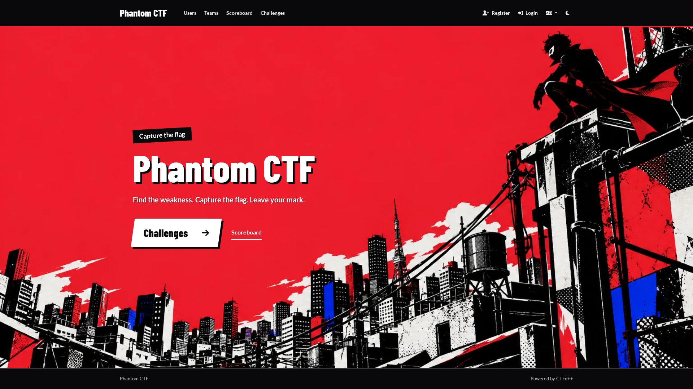
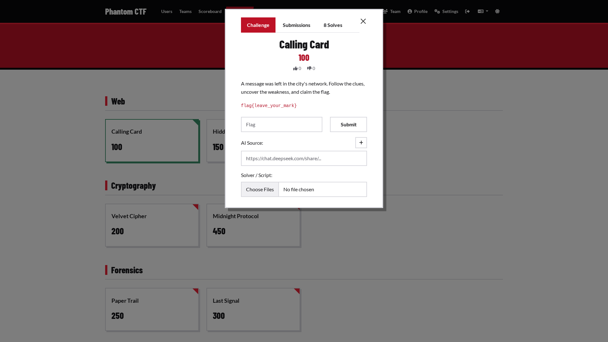

# Phantom

A selectable Persona 5-inspired participant theme for CTFd++. Select `phantom`
in Admin > Config > Theme. Admin pages keep the existing admin design.

The homepage uses the configured event name, description and logo. Content
saved in the index page remains visible beneath the illustrated hero. Other
pages inherit the core templates, including solver uploads, AI sources,
notifications and team features. Both light and dark modes are supported.

The theme is contained in this folder and can be removed after switching to
another theme. It needs no database migration, npm package or external font
service. Core theme fallback must remain enabled (the default).

## Preview

Full 1920 x 1080 browser captures of the homepage and challenge dialog:

## Assets

`static/img/city.webp` is original artwork generated with the built-in imagegen
tool. Prompt: original urban cyber-heist comic poster, red/black/white
screenprint, Tokyo-like rooftops, anonymous masked silhouette, generous red
negative space for event text, crisp halftone and angular ink cutouts, no text.

Barlow Condensed by Jeremy Tribby is bundled under the SIL Open Font License;
see `static/fonts/OFL.txt`. Body text uses the core theme's bundled Lato font.
