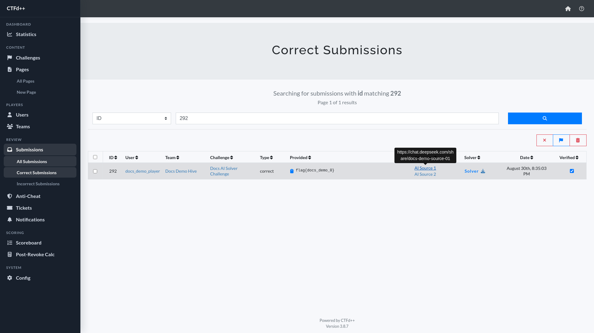

# CTFd++

CTFd++ is a fork of [CTFd](https://github.com/CTFd/CTFd), the open-source Capture The Flag framework. It keeps the full CTFd feature set and adds competition operations, review workflows, anti-cheat tooling, and quality-of-life improvements.

## Running This CTFd++ Instance

Use `./run.sh` as the entrypoint for this deployment. Running `./run.sh` with no arguments prints the help text.

- First run: `./run.sh start` generates local credentials, writes `.env`, and starts Docker Compose.
- Normal restart/re-up: `./run.sh start` or `docker compose up -d` starts the existing instance with the current `.env` and data. It does not rotate credentials.
- Full local reset: `./run.sh reset` stops the stack, deletes local data/config/credentials, generates fresh credentials, and starts a new instance. Use `./run.sh reset --yes` to skip the confirmation prompt.

After startup, open CTFd++ at `http://<server>/` or `http://<server>:8000/`.

## Features Added in CTFd++

### Reset and Automatic Exports

- Removed the admin reset feature and Danger Zone UI. Switching back to user mode now requires a full CTFd++ reset from the CLI.
- Added automatic exports every 20 minutes while the competition is running. Exports are saved in `.export`, and the oldest exports are removed when the folder reaches 1 GB.

### Admin Sidebar Navigation

Reworked the admin panel into a persistent left sidebar layout so high-use sections stay visible, including review workflows, scoring tools, and system configuration.

  

### Challenge Submission Metadata

Added challenge submission metadata for `AI Source` links and solver/script uploads.

  

### Custom Submission Settings

Added `Custom` configuration for the accepted AI Source regex, solver file count limit, and solver total size limit.

  

### Per-Challenge Requirements

Added per-challenge `Need AI` and `Need Solver` settings, including challenge creation/editing controls and admin challenge-table indicators.

  

### Submission Review Metadata

Added AI Source and Solver links to the admin submissions table, syntax-highlighted solver previews, AI Source tooltips, and a manual `Verified` checkbox for reviewer tracking. Assistants with submission read and file permissions can review/download solver uploads without broad write access.

  

  

  

  

### Anti-Cheat Review

Added anti-cheat event detection and review tooling for shared IPs, shared user agents, shared browser fingerprints, repeated wrong answers, rapid solves, challenge-file download timing, and churn-style signals.

  

### Ticket Workflow

Added a `Ticket` admin workflow for targeted user/team notifications. Pending tickets repeat on page refresh until moved to `Ongoing`; resolving a ticket requires a resolve note and is final. Tickets support toast or alert presentation, optional notification sound, and assistant access through the normal permission system.

  

  

  

### Announcer Bot

Added an Announcer Bot under admin configuration for Discord webhook solve announcements. It supports first blood, second blood, third blood, and normal solve announcements, configurable bot identity, embed colors/images/footer, editable JSON templates, test sends, delivery logs, and manual resend from a saved log payload.

  

### Post-Revoke Calculator

Added Post-Revoke Calc for simulated post-event score review, including simulated bans, solve/award revokes, percentage score adjustments, notes, challenge score recalculation, bracket filtering, reset backups, CTFd++ export/import support, and PDF export. Challenge rows can be opened to review every correct submission for that challenge with the same score percentage, revoke, note, and banned-status controls.

  

  

### Assistant Admin Role

Added an `Assistant` admin role with configurable access control. Full admins can grant scoped access to admin sections, including separate read/write permissions for Users, Teams, Submissions, and Post-Revoke Calc.

  

  

### Deployment and Test Scripts

- Added `run.sh` to initialize fresh deployments, reuse existing credentials/data on normal starts, and reset local infrastructure on request.
- Added `reset.sh` for full-instance reset with seven confirmations. It exports the current instance into `.reset`, archives `.export` into `.reset` with a timestamp, and then starts a fresh stack.
- Added `scripts/trigger_anti_cheat.py` to generate local demo events for validating the anti-cheat detectors.

## Based on CTFd

CTFd++ is built on top of CTFd. All core CTFd functionality is included: challenges, dynamic scoring, teams and users, scoreboard, plugins, themes, imports/exports, email, and more. See the upstream [CTFd repository](https://github.com/CTFd/CTFd) and [CTFd documentation](https://docs.ctfd.io/) for base platform usage and configuration.

CTFd++ is distributed under the [Apache License 2.0](LICENSE), the same license as CTFd.

## Credits

- Logo by [Laura Barbera](http://www.laurabb.com/)
- Theme by [Christopher Thompson](https://github.com/breadchris)
- Notification Sound by [Terrence Martin](https://soundcloud.com/tj-martin-composer)
